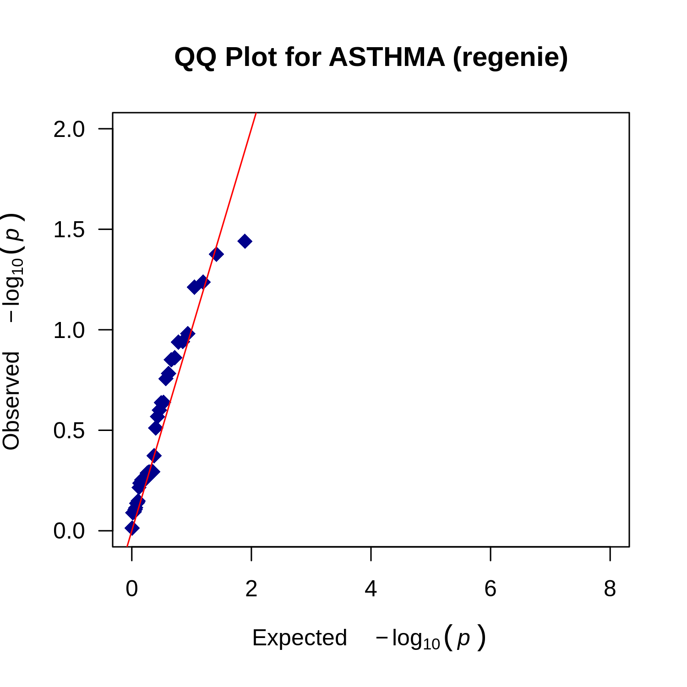
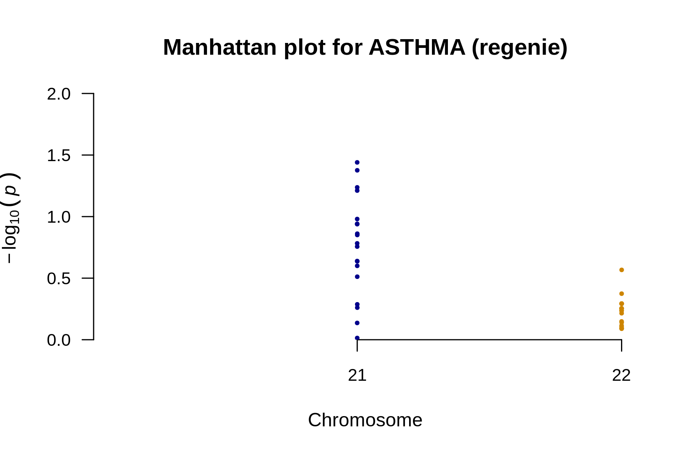
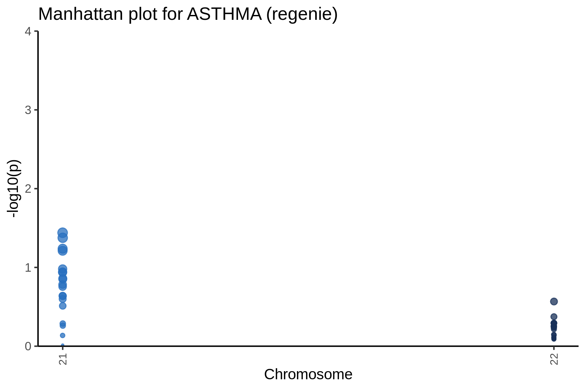

# QQ plot for ASTHMA



---

# Manhattan plot for ASTHMA



---

# Manhattan plot for ASTHMA



---

# Result files
```
/Users/zhoujiayi/Documents/GitHub/bioworkflows/GWAS/output/regenie_MWE/phenotypes_ASTHMA.regenie.analysis_summary.md
/Users/zhoujiayi/Documents/GitHub/bioworkflows/GWAS/output/regenie_MWE/phenotypes_ASTHMA.regenie.manhattan_annotated.png
/Users/zhoujiayi/Documents/GitHub/bioworkflows/GWAS/output/regenie_MWE/phenotypes_ASTHMA.regenie.manhattan.png
/Users/zhoujiayi/Documents/GitHub/bioworkflows/GWAS/output/regenie_MWE/phenotypes_ASTHMA.regenie.plot_data.rds
/Users/zhoujiayi/Documents/GitHub/bioworkflows/GWAS/output/regenie_MWE/phenotypes_ASTHMA.regenie.qq.png
/Users/zhoujiayi/Documents/GitHub/bioworkflows/GWAS/output/regenie_MWE/phenotypes_ASTHMA.regenie.snp_counts.txt
/Users/zhoujiayi/Documents/GitHub/bioworkflows/GWAS/output/regenie_MWE/phenotypes_ASTHMA.regenie.snp_stats.gz
/Users/zhoujiayi/Documents/GitHub/bioworkflows/GWAS/output/regenie_MWE/phenotypes_ASTHMA.regenie.snp_stats.log
/Users/zhoujiayi/Documents/GitHub/bioworkflows/GWAS/output/regenie_MWE/phenotypes_ASTHMA.regenie.snp_stats_original_columns.gz
```
